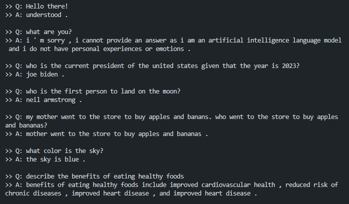

# transformer-chatbot
An encoder-decoder transformer model based on the 2017 paper "Attention is All You Need" by A. Vaswani et al. made in TensorFlow.

## About
- Takes in and outputs a maximum of 100 tokens.
- Trained using the <a href="https://huggingface.co/datasets/MBZUAI/LaMini-instruction" target="_blank">LaMini-instruction</a> dataset.

## How to run
- Create a docker image by typing the command below in the project directory.
```bash
docker build -t chatbot-py .
```
- Create a container from the image.
```bash
docker run -it chatbot-py 
```
- The chatbot is ready to be interacted with in the terminal after the `>>Q:` appears.

## Demo



## Things to take note of:
- May output accurate responses to trivial questions.
- Can sometimes perform basic tasks (create sentences, transform sentences, answer questions based on another sentence, etc.)
- The model is not fine-tuned.
- May output highly inaccurate data.
- May constantly repeat itself until a maximum of 100 tokens is met.

## Architecture

